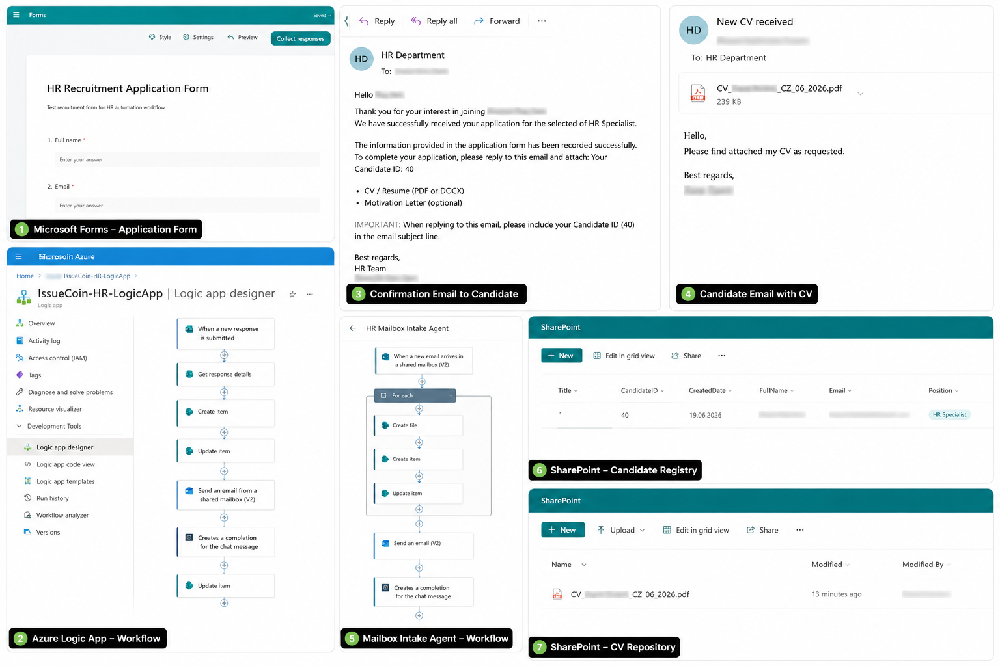

## (CZ) AI HR Recruitment Workflow
📌 Přehled projektu

Tento projekt představuje automatizovaný HR náborový proces vytvořený pomocí služeb Microsoft 365 a Azure.

Kandidát vyplní formulář v Microsoft Forms. Workflow následně automaticky vytvoří záznam v SharePointu, vygeneruje Candidate ID, odešle potvrzovací e-mail a zpracuje zaslaný životopis pomocí automatizovaného Mailbox Intake Agent workflow.

Projekt slouží jako praktická ukázka využití Microsoft 365, Azure Logic Apps, SharePointu, Power Automate a Azure OpenAI pro automatizaci náborových procesů.

## 🏗️ Architecture

Candidate
↓
Microsoft Forms
↓
Azure Logic App
├─ Create Candidate Record
├─ Generate Candidate ID
├─ Send Confirmation Email
└─ SharePoint Candidate Registry
↓
Candidate Sends CV
↓
Shared HR Mailbox
↓
Mailbox Intake Agent
├─ Save CV to SharePoint
├─ Update Candidate Record
└─ Notify HR Team
↓
Azure OpenAI
↓
AI Candidate Analysis

## 📷 Přehled workflow:

## ⚙ Použité technologie:
- Microsoft Forms
- Azure Logic Apps
- Power Automate
- SharePoint Online
- Outlook Shared Mailbox
- Azure OpenAI
- Microsoft 365

## 🚀 Kroky workflow
1. Registrace kandidáta: Kandidát odešle žádost prostřednictvím Microsoft Forms.

2. Zpracování v Azure Logic App: Workflow automaticky:
- načte data z formuláře
- vytvoří záznam v SharePointu
- vytvoří Candidate ID
- aktualizuje záznam
- odešle potvrzovací e-mail

3. Potvrzovací e-mail: Uchazeč obdrží potvrzovací e-mail obsahující:
- Candidate ID
- pokyny k zaslání životopisu
- informace o náborovém procesu

4. Zpracování životopisu: Uchazeč odpoví na e-mail a přiloží životopis.
Workflow automaticky:
- monitoruje HR schránku
- detekuje přílohy
- ukládá CV do SharePointu
- aktualizuje záznam kandidáta

5. AI analýza. Azure OpenAI lze využít pro:
- shrnutí životopisu
- identifikaci dovedností
- hodnocení kandidátů
- doporučení pro HR tým

## 🔒 Bezpečnost
Veřejná verze projektu obsahuje pouze anonymizovaná data. Byly odstraněny nebo rozmazány:
jména, e-mailové adresy, informace o tenantovi, interní identifikátory, osobní údaje.

## 📈 Stav projektu: Proof of Concept (PoC) úspěšně dokončen

**Budoucí roadmapa projektu:**

* Rozšířené AI vyhodnocování kandidátů
* Automatické notifikace do Microsoft Teams
* HR dashboardy a analytický reporting
* Multi-agentní systém pro podporu náborového procesu

👩‍💻 Autor: Denisa Pitnerová
Junior Cloud Administrator
Microsoft 365 & Azure Enthusiast

Zájmy: Microsoft 365, Azure, SharePoint, Power Platform, Azure OpenAI, Workflow Automation, AI Agenti, Cloud Governance

------------
## (EN) AI HR Recruitment Workflow
📌 Project Overview

This project demonstrates an automated HR recruitment process built with Microsoft 365 and Azure services.

The candidate submits an application using Microsoft Forms. The workflow automatically creates a SharePoint record, generates a Candidate ID, sends a confirmation email and processes incoming CVs using an automated Mailbox Intake Agent workflow.

The project serves as a practical demonstration of Microsoft 365, Azure Logic Apps, SharePoint, Power Automate and Azure OpenAI integration for recruitment process automation.

## 🏗️ Architecture

Candidate
↓
Microsoft Forms
↓
Azure Logic App
├─ Create Candidate Record
├─ Generate Candidate ID
├─ Send Confirmation Email
└─ SharePoint Candidate Registry
↓
Candidate Sends CV
↓
Shared HR Mailbox
↓
Mailbox Intake Agent
├─ Save CV to SharePoint
├─ Update Candidate Record
└─ Notify HR Team
↓
Azure OpenAI
↓
AI Candidate Analysis

## 📷 Workflow Overview

## ⚙ Technologies
- Microsoft Forms
- Azure Logic Apps
- Power Automate
- SharePoint Online
- Outlook Shared Mailbox
- Azure OpenAI
- Microsoft 365

## 🚀 Workflow Steps
1. Candidate Registration: The candidate submits an application using Microsoft Forms.

2. Azure Logic App Processing: The workflow automatically:
- retrieves form data
- creates a SharePoint record
- generates a Candidate ID
- updates the record
- sends a confirmation email

3. Confirmation Email: The applicant receives a confirmation email containing:
- Candidate ID
- instructions for CV submission
- recruitment process information

4. CV Processing: The candidate replies to the email and attaches a CV. The workflow automatically:
- monitors the HR mailbox
- detects attachments
- stores CVs in SharePoint
- updates candidate records

5. AI Analysis. Azure OpenAI can be used for:
- CV summarization
- skill extraction
- candidate evaluation
- recruitment recommendations

## 🔒 Security
This public GitHub version contains only anonymized data.Removed or blurred information: names, email addresses, tenant information, internal identifiers, personal data

## 📈 Status: Completed Proof of Concept (PoC)

Future roadmap:
- Advanced AI candidate scoring
- Teams notifications
- HR dashboard and reporting
- Multi-agent recruitment workflow

👩‍💻 Author: Denisa Pitnerová
Junior Cloud Administrator
Microsoft 365 & Azure Enthusiast

Areas of interest: Microsoft 365, Azure, SharePoint, Power Platform, Azure OpenAI, Workflow Automation, AI Agents, Cloud Governance
